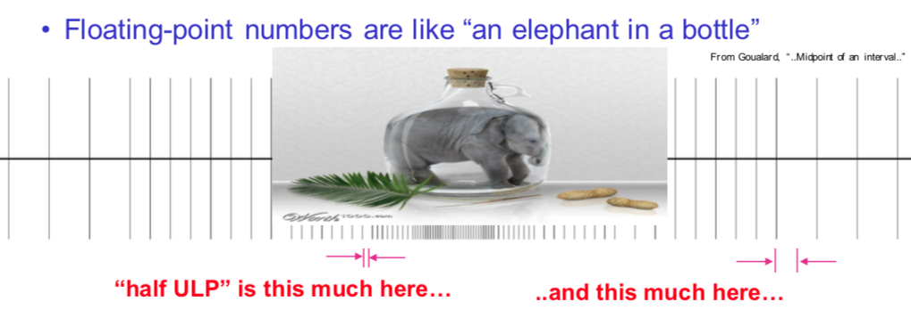
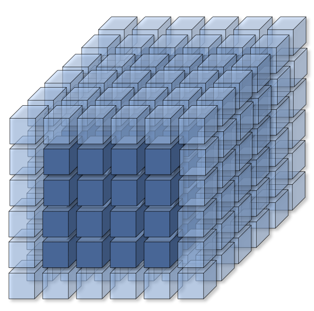
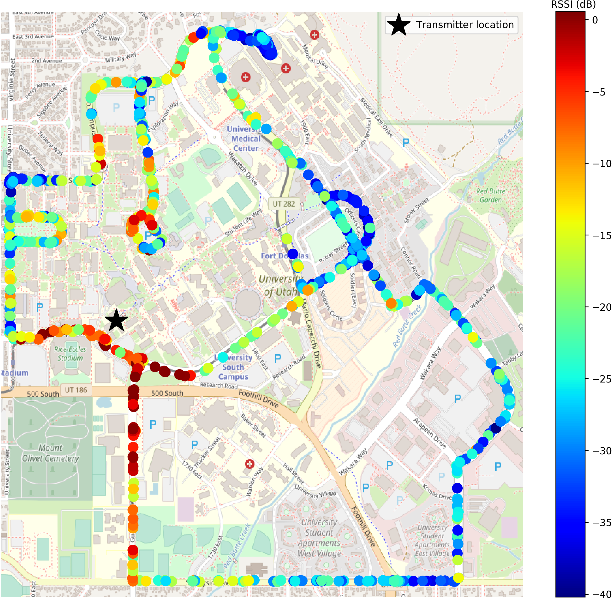
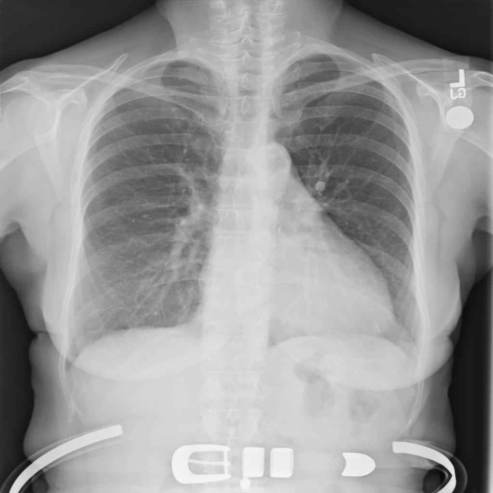
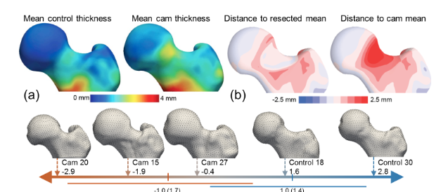

## Programming Systems 

| Faculty | Research Areas | Project Description                |
|---------|----------------|------------------------------------|
| [Ganesh Gopalakrishnan][gg] | Formal methods, floating point arithmetic | **Making Numerical Data Representation Efficient and Reliable:** Conceptually, HPC and ML involve representing and manipulating real numbers. This is done in practice using finite-precision floating-point numbers. Reducing the bit-width of floating-point numbers can dramatically improve performance as well as reduce energy consumption, but runs the risk of losing accuracy. This tradeoff will be carefully studied by the trainees.|

| [Mary Hall][mh] | Compilers, Performance | **Sparse Tensor Code Synthesis with Automated Weight Reduction:** Tensors can be used to represent data sets such as  images. Such tensors can be sparsified, and the generated code can take advantage of this sparsity, helping reduce total computation and data movement.  This research will involve implementing functions to sparsify networks, considering implications on code synthesis, performance and accuracy. |

## Practice 

| Faculty | Research Areas | Project Description                |
|---------|----------------|------------------------------------|
| [Eric Eide][ee] | Systems, Compilers | **Resilient Software Infrastructure for Wireless IoT Applications:** Using Utah's [POWDER](https://le.utah.gov/interim/2019/pdf/00004535.pdf) mobile and wireless *living laboratory*, distributed Internet-of-Things~(IoT) applications can be deployed and evaluated---but once deployed, the reliable behavior of an application is mostly up to the application itself.  E.g., can it operate correctly when one of its devices becomes unreachable? This project will explore, demonstrate, and/or enhance one or more open-source IoT programming platforms for conducting self-repairing wireless experiments in POWDER.  The project will introduce students to the challenges of reproducibility in POWDER, where devices and networks are not always reliable. |
| [Jason Weise][jw] | Personal Data, HCI | **Human-Centered Design Applied to CloudLab Configuration:** Enable CloudLab users to make their work reproducible to: (1) resume work  even after a CloudLab reservation has expired; (2) share their work within their research lab; or, (3) submit it to an artifact evaluation committee.  This research will identify and explore  opportunities for better interface-level support to facilitate reproducibility while projects are in progress, rather than as a discrete final step at the end of a project. It will leverage Human-Centered Computing methods, including user observation, low- and medium-fidelity prototyping, and participatory design activities. |
| [Mu Zhang][mz] | Software Security, Privacy | **Security Analysis of Configurable Scientific Computing Environments:** The software stacks of high performance computing infrastructure are at great risk, as evidenced by real-world attacks. Detecting vulnerabilities in HPC settings remains a challenging task because it requires a holistic understanding of highly-configurable scientific computing contexts. This project seeks to investigate the hardware, software and runtime contexts of HPC infrastructure, develop tools to comprehensively extract such contexts from individual HPC deployments, and incorporate a contextual model into automated vulnerability detection. |

## Machine Learning 

| Faculty | Research Areas | Project Description                |
|---------|----------------|------------------------------------|
| [Aditya Bhaskara][ab] | Machine Learning, Theory | **Semantic and Statistical Biases in Neural Net Compression:** Current neural network compression pipelines aim to attain top-1 accuracy matching that of the original (uncompressed) network. This is well-known to introduce biases during classification. The project will help the trainees understand these biases by first showing them what the original network *learns* in its intermediate layers and comparing this to what a compressed network learns. |
| [Jeff Phillips][jp] | Algorithms for Big Data, ML | **Building Featurized Representations:** Most machine learning algorithms are designed and implemented for data sets that are represented as vectors, or belong to some very common structure like text or images, where the first step is to convert them to some community-developed featurized representation.  Data sets such as the mix of spatial and meta data emerging from RSSI signals from campus buses is not originally in such a form.  This project will focus on the data manipulation task of converting abstract data that mixes spatial, temporal, and categorical data from POWDER into a vectorized representation that preserves the many signals that the complex data is capturing.  From there students will be able to easily apply various built-in learning algorithms (e.g., directly invoke sk-learn functions) and see what properties can and cannot be predicted from a single unified vector representation. |
| [P. Sadayappan][ps] | Compilers, Perf. Optimization, Matrix-Tensor Computation, Data Movement Complexity | Deep Neural Network models with very high accuracy have been developed for image processing and natural language processing applications. But accurate ML  models often are very large and extremely compute-intensive, making them infeasible to deploy in many contexts, e.g., edge devices. A challenge in developing more compact models is that unlike large models, the execution time and expended energy are no longer directly proportional to the number of arithmetic operations. This is because data movement overheads are much more difficult to amortize with compact ML models. This project will %explore the development of compare performance models for compact neural networks and the trade-offs between model size, model performance, and accuracy. |

## Applications

| Faculty | Research Areas | Project Description                |
|---------|----------------|------------------------------------|
| [Shireen Elhabian][se] | Statistical machine learning, computational methods for medical image analysis | **Scalable Architectures for Inferring Anatomy Directly from Images:** Anatomies' form (or shape) and function relationship is a central theme in biology where abnormal shape changes are closely tied to pathological functions. This research will expose trainees to the rudiments of statistical shape modeling. It will show how segmenting the anatomy of interest is carried out on volumetric images. |
| [Hari Sundar][hs] | Computationally optimal parallel high-performance algorithms | **Tracking inertial migration of particles:** The study of particles (cells, precipitates) in aqueous flow is useful in biological processing, chemical reaction control, and for creating structured materials. This projects will explore the use of machine learning to estimate migration maps for particles, using existing simulation data, and evaluate it using new particle/obstruction configurations. Hands-on demonstrations using prepackaged experiments will be the approach taken. |

[ab]: https://www.cs.utah.edu/~bhaskara/
[ee]: https://www.cs.utah.edu/~eeide/
[se]: http://www.sci.utah.edu/~shireen/
[gg]: https://www.cs.utah.edu/~ganesh/
[mh]: https://www.cs.utah.edu/~mhall/
[jp]: https://www.cs.utah.edu/~jeffp/
[ps]: https://www.cs.utah.edu/~saday/
[hs]: https://www.cs.utah.edu/~hari
[jw]: https://www.cs.utah.edu/~weise
[mz]: https://sites.google.com/site/muzhang82
